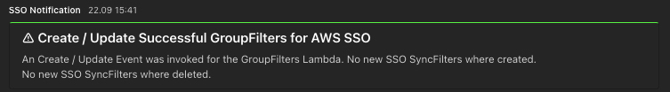
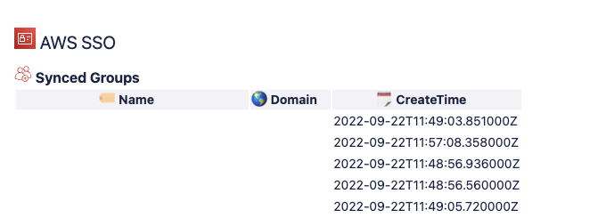

# AWS IAM Identity Center (successor to AWS SSO) GroupSync Filter Automation

## Description
This solution creates a Lambda to manage Ad-Group Sync Filters in AWS IAM Identity Center (successor to AWS SSO).
The Lambda will automatically create a documentation and sends notification to MS Teams.

### Architecture

#### Example Notification

#### Example Documentation

 

| Author's |
|--------|
| David Krohn   [Linkedin](https://www.linkedin.com/in/daknhh/) - [Blog](https://dakn.ml)|
| Marcell Jobs   [Linkedin](https://www.linkedin.com/in/marcell-jobs-97b60b6a/)|

 

## Deployment

The deployment is done via task file and deployed to the account via CloudFormaton Stack.

### Prerequisites

- [AWS CLI](https://aws.amazon.com/de/cli/) is installed and configured
- [awsume](https://awsu.me/) is installed
- [Taskfile](https://taskfile.dev/) is installed
- [AWS CDK](https://docs.aws.amazon.com/cdk/v2/guide/getting_started.html) is installed

### Automated deployment with a Taskfile
1. open shell
2. execute command: `awsume DEPLOYMENTACCOUNT`
3. execute command: `task deploy`.
