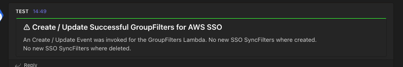

# AWS IAM Identity Center (successor to AWS SSO) GroupSync Filter Automation

## Description
This solution establishes a Lambda function to oversee Ad-Group Sync Filters within the AWS IAM Identity Center (the successor to AWS SSO). Using LDAPs as the source, it synchronises designated groups with your AWS IAM Identity Center.
The Lambda works autonomously, automatically generating documentation and sending notifications to Microsoft Teams.

### Architecture

#### Example Notification

#### Example Documentation

 

| Author's |
|--------|
| David Krohn   [Linkedin](https://www.linkedin.com/in/daknhh/) - [Blog](https://dakn.ml)|
| Marcell Jobs   [Linkedin](https://www.linkedin.com/in/marcell-jobs-97b60b6a/)|

 

### Prerequisites

- [AWS CLI](https://aws.amazon.com/de/cli/) is installed and configured
- [awsume](https://awsu.me/) is installed
- [AWS CDK](https://docs.aws.amazon.com/cdk/v2/guide/getting_started.html) is installed

### Configuration

Configuration Parameters of this solution are store in value files. You can find an example in: 'values/sandbox'.
To securly store Passwort and Username for LDAPs login credentials we are using (cdk-sops)[https://github.com/dbsystel/cdk-sops-secrets].
Please ensure to encrypt your SecretFile and adjust the values before deploying.

### Deployment
1. Open shell
2. Adjust parameters in value files
3. Add your KMS key to sops.yaml
4. Encrypt SecretFile via `sops -e <filename>`
5. execute command: `assume <accountname>`
6. execute command: `cdk deploy <stackname>`
